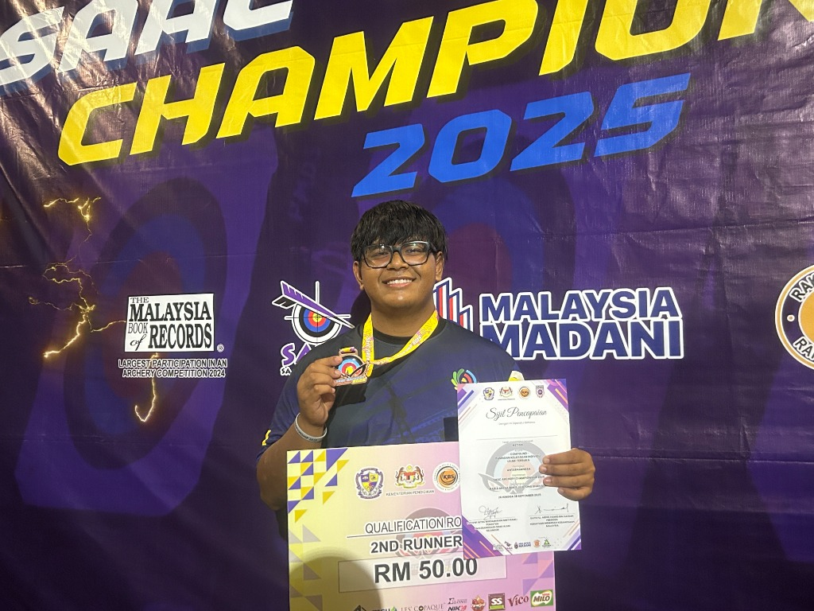

# Muhammad Johan Irfan — Professional Portfolio

A modern, high-performance developer and requirements engineer portfolio website built with **Next.js 16**, **React 19**, **TypeScript**, and **Tailwind CSS v4**.



---

## 🚀 Key Highlights & Features

- **🌓 Dynamic Light & Dark Mode with System Sync**:
  - Automatically matches OS color scheme (`prefers-color-scheme`).
  - 3-state cycling toggle (`Auto / System` ➔ `Light` ➔ `Dark`).
  - Zero-flash on load (anti-FOUC) with local storage persistence.
- **🌐 Seamless Bilingual Localization (i18n)**:
  - Instant language switching between **English** and **Bahasa Melayu** across all sections without page reload.
- **🎯 Requirements Engineering & GovTech Showcase**:
  - Detailed breakdown of public sector digital transformation artifacts (BRS, SRS, SDS, Traceability Matrices) completed at **GovTech Malaysia (Kementerian Digital)**.
- **💻 Interactive Project Portfolio**:
  - Comprehensive modal breakdowns with architecture highlights, tech stacks, GitHub source links, and live demos.
- **🏆 Leadership & Academic Honors**:
  - Academic excellence (CGPA 3.54, 5x Dean's List at IIUM) and Archery Team Captaincy (SAAC Championship 2025).
- **📫 Streamlined Contact Channels**:
  - One-click copy email button, direct compose link, and LinkedIn integration.

---

## 🛠️ Tech Stack

| Category | Technology |
| :--- | :--- |
| **Framework** | [Next.js 16](https://nextjs.org/) (App Router, Webpack) |
| **UI & Core** | [React 19](https://react.dev/), [TypeScript](https://www.typescriptlang.org/) |
| **Styling** | [Tailwind CSS v4](https://tailwindcss.com/), CSS Custom Variables Design System |
| **Icons** | [Lucide React](https://lucide.dev/), Custom Archery & GovTech SVG Motifs |
| **Testing** | [Puppeteer](https://pptr.dev/) (Visual & System Theme Verification) |

---

## 📁 Project Structure

```text
johan-portfolio/
├── public/
│   └── images/              # Profile portraits & hero background assets
├── src/
│   ├── app/
│   │   ├── globals.css      # Dual-theme design tokens & custom variants
│   │   ├── layout.tsx       # Root layout, theme script, and metadata
│   │   └── page.tsx         # Portfolio main landing page
│   ├── components/
│   │   ├── Navbar.tsx       # Glassmorphism header with theme & lang toggles
│   │   ├── Hero.tsx         # Hero section with portrait backdrop & badges
│   │   ├── About.tsx        # Background, education, & core principles
│   │   ├── Skills.tsx       # Technical, RE, and security competencies
│   │   ├── Experience.tsx   # GovTech internship & leadership history
│   │   ├── Projects.tsx     # Project grid with modal trigger previews
│   │   ├── ProjectModal.tsx # Detailed deep-dive architecture modal
│   │   ├── Achievements.tsx # Dean's list & archery championship honors
│   │   ├── Contact.tsx      # Direct communication cards & availability banner
│   │   └── Footer.tsx       # Footer links & copyright
│   ├── context/
│   │   ├── ThemeContext.tsx # 3-state theme & OS change listener
│   │   └── LanguageContext.tsx # Dual-language provider
│   ├── locales/
│   │   ├── en.ts            # English translations
│   │   └── ms.ts            # Bahasa Melayu translations
│   └── types/
│       └── portfolio.ts     # TypeScript interfaces & types
└── package.json
```

---

## 💻 Getting Started

### Prerequisites
- Node.js 18.17+ or later
- npm, yarn, or pnpm

### Installation

1. Clone the repository:
   ```bash
   git clone https://github.com/your-username/johan-portfolio.git
   cd johan-portfolio
   ```

2. Install dependencies:
   ```bash
   npm install
   ```

3. Run the development server:
   ```bash
   npm run dev
   ```

4. Open [http://localhost:3000](http://localhost:3000) in your browser.

---

## 🏗️ Production Build & Verification

Lint code and verify production build:

```bash
npm run lint
npm run build
npm start
```

---

## 👤 Author

**Muhammad Johan Irfan Khairudin**  
- **Role**: Requirements Engineer & Full-Stack Developer
- **Education**: Bachelor of Information Technology (Honours), International Islamic University Malaysia (IIUM)
- **Specialization**: Information Security & Requirements Engineering
- **Email**: [johanirfan123@gmail.com](mailto:johanirfan123@gmail.com)
- **LinkedIn**: [muhammad-johan-irfan-khairudin](https://www.linkedin.com/in/muhammad-johan-irfan-khairudin-a234a6200)
